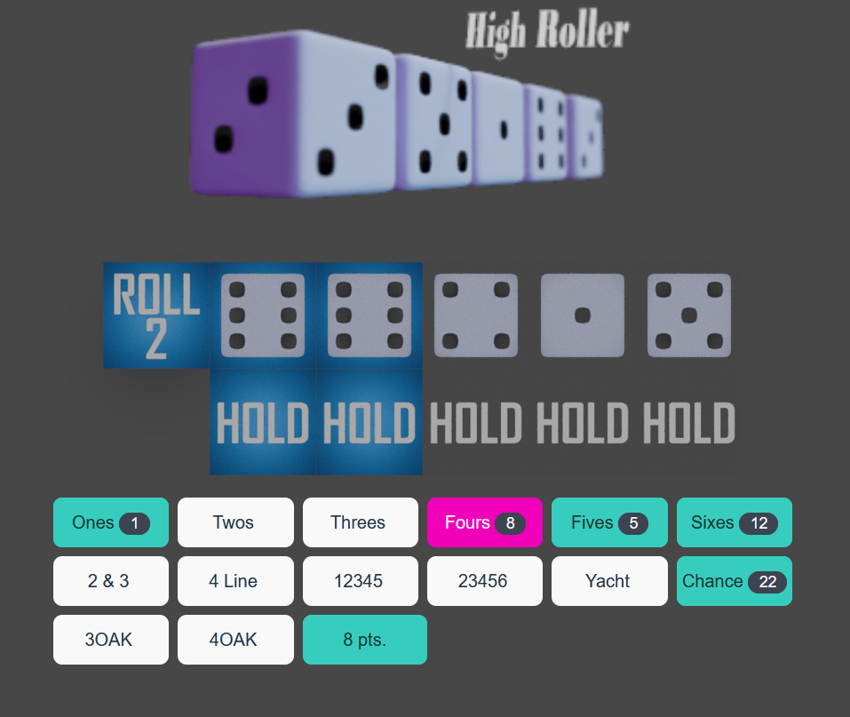

# High Roller

### A dice rolling game similar to Yacht and Yahtzee.

---

---

- Game consists of 14 rounds.

- At the start of each round, you cast five dice.

- If you click on a die (so it has a blue background) that die is locked. If you roll again, that die won't change.

- You can click on it again to unlock it, so if you roll again, it can change.

- You can cast the dice up to three times.

- You can choose a score category by clicking on it. You can do this before you've run out of rolls.

- Once you've run out of rolls, you have to choose a score category. It may not give you any points :(

- For example, "Threes" will give 6 points if there are two dice with a 3, or 9 points if there are three dice with a 3.

- "3OAK" will score 20 if you have 3 dice with the same number of pips, like 34331 (three 3s)

- the game ends when each score category has been chosen.

A score of over 200 is good, a score over 300 is really good. Anything over 350+ is exceptional!
